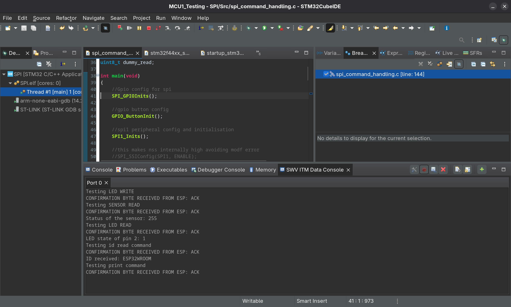
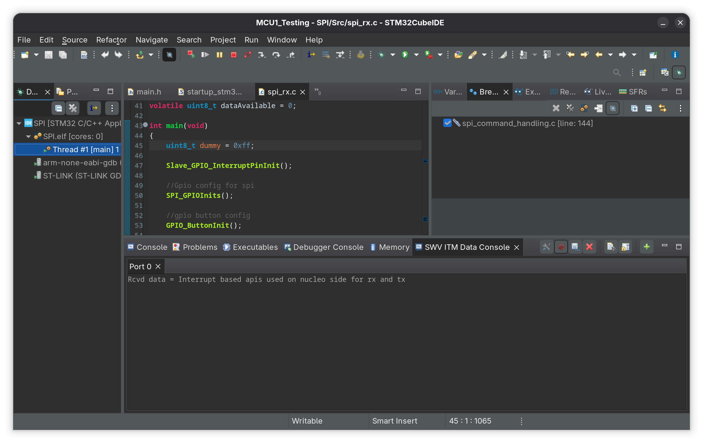
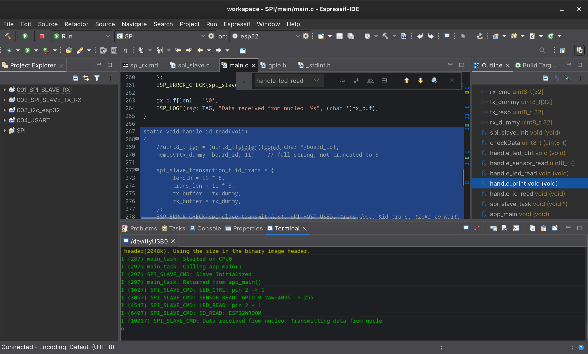
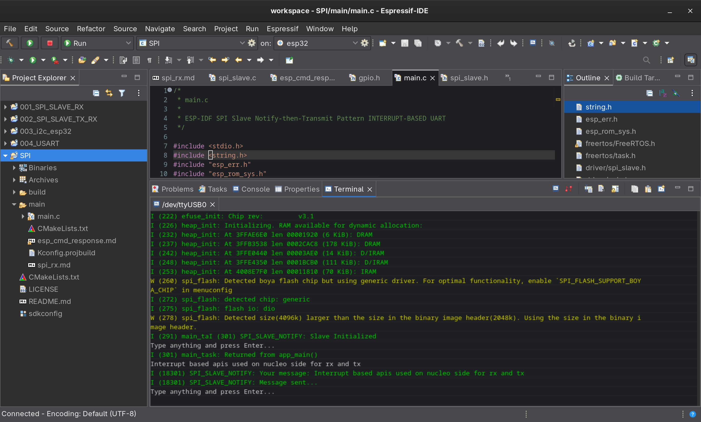
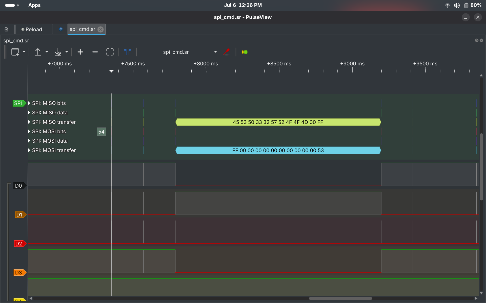

# SPI Cross-Platform Communication - STM32 Nucleo-F446RE ↔ ESP32

Bare-metal STM32 SPI driver talking to an ESP-IDF SPI slave on the ESP32,
covering a basic receive-only exercise and a full command/response
protocol (LED control, sensor read, LED read, print, ID read).

## Hardware

| Signal | STM32 (Nucleo, SPI1) | ESP32 (SPI2) |
|--------|----------------------|--------------|
| NSS/CS | PA4                  | GPIO15       |
| SCK    | PA5                  | GPIO14       |
| MISO   | PA6                  | GPIO12       |
| MOSI   | PA7                  | GPIO13       |
| GND    | GND                  | GND          |

Mode 0 (CPOL=0, CPHA=0), 8-bit frames, hardware NSS management on the
STM32 side (`SPI_SSOEConfig`).

## Tools

- STM32CubeIDE (Nucleo-F446RE firmware)
- Espressif-IDE / ESP-IDF (ESP32 firmware, `driver/spi_slave.h`)
- PulseView (bus capture/analysis)

## What's implemented

| Exercise | ESP32 | Nucleo | API | 
|----------|-------|--------|-----|
| Basic receive-only | Slave (receives a length-prefixed message) | Master | Polling |
| Command/response: LED_CTRL | Slave | Master | Polling | 
| Command/response: SENSOR_READ | Slave | Master | Polling | 
| Command/response: LED_READ | Slave | Master | Polling | 
| Command/response: PRINT | Slave | Master | Polling | 
| Command/response: ID_READ | Slave | Master | Polling | 
| Receive data from esp, interrupt-driven | Slave | Master | IT | 

## Screenshots

### STM32CubeIDE
- SWV ITM data console displaying all the commands being sent and executed by esp 

- Data being received from slave esp32 by using IT based APIs on nucleo side

### Espressif-IDE
- ESP IDE terminal displaying the commands being received from the nucleo and the status of the commands being sent to nucleo

- Data taken from user being sent from slave esp to nucleo

### PulseView captures

- Full command/response cycle of the device id command (0x54) 

## Known issues & lessons learned

### 1. AVR-style continuous-CS protocols don't port to ESP32's transaction-based SPI slave driver

The original Arduino sketches assume an AVR hardware SPI slave, which
shifts one byte at a time and lets firmware react to each byte
individually (`SPI_SlaveReceive()` polled in a loop) while CS stays
held low for the entire multi-byte exchange.

ESP-IDF's `spi_slave_transmit()` is fundamentally different: it commits
to one fixed-length, full-duplex transaction *before* the transaction
starts, and only returns control once the whole thing — CS low to CS
high — has completed. There is no way to inspect byte N mid-transaction
to decide what byte N+1 should be.

**Fix:** every command was redesigned as a *sequence of separate,
fixed-length transactions* (one CS pulse per logical step: command,
ack, argument(s), response), instead of one long continuous exchange.
This required rewriting the STM32 master side to open and close a new
`SPI_PeripheralControl(ENABLE)`/`(DISABLE)` bracket per step, matching
one `spi_slave_transmit()` call per bracket on the ESP32 side.

### 2. Every CS-pulse-to-CS-pulse transition needs a timing margin

**Symptom:** intermittent correct-looking results that broke down
under real testing — commands read back stale data, or the *next*
command byte arrived corrupted, even though each individual step's
logic was correct in isolation.

**Cause:** the same underlying issue as the I2C clock-stretching saga,
resurfacing on SPI: opening a new CS pulse immediately after closing
the previous one gives the ESP32's FreeRTOS task zero time to process
what it just received and arm the next transaction before the master's
next pulse arrives. Since ESP32 SPI slave mode has no equivalent of
I2C clock stretching either, there's no hardware mechanism forcing the
master to wait.

**Fix:** a `delay()` between every `DISABLE`→`ENABLE` transition on the
Nucleo master, for every command, without exception. This had to be
independently re-discovered and re-applied per command during
development — a missing delay on any single pulse boundary reliably
desynchronized byte framing on every transaction after it.

### 3. Bits vs. bytes in `spi_slave_transaction_t.length`

Recurring mistake across multiple handlers: `.length` and `.trans_len`
are specified in **bits**, not bytes. Using a raw byte count directly
(instead of `count * 8`) silently arms a transaction a fraction of the
intended size, which — combined with issue #2 — corrupts the framing
of whatever pulse follows.

### 4. Two lengths describing the same data must come from the same source

**Symptom:** `PRINT` and `ID_READ` intermittently failed or returned
truncated/garbled data even after the bits/bytes fix.

**Cause:** the master and slave each independently hardcoded or
recomputed a "how many bytes" value instead of one side deriving it
and the other side reading that exact value — e.g. the ESP32 fixing a
transaction at 32 bytes regardless of the real string length the
master sent, or truncating `board_id` to 8 characters while the master
expected to read only 1. Any mismatch between the two sides' byte
counts corrupts that transaction and cascades into the next command's
framing.

**Fix:** established one rule and applied it everywhere: whichever
side computes a length dynamically (`strlen()`, a received length
byte), the *other* side's transaction size must be built from that
same value — never a separately hardcoded number.

### 5. `GPIO_MODE_OUTPUT` does not enable the input path

**Symptom:** `LED_READ` always reported `0`, regardless of the LED's
actual, visibly-lit state.

**Cause:** `LED_CTRL` configured the pin with `gpio_set_direction(pin,
GPIO_MODE_OUTPUT)`. On ESP32, that mode enables only the output
driver — `gpio_get_level()` reads from the input buffer, which was
never enabled, so it read back a disconnected register instead of the
real pin state.

**Fix:** `GPIO_MODE_INPUT_OUTPUT` instead of `GPIO_MODE_OUTPUT`, so the
same pin can be driven and read back correctly.

### 6. A computed response with no transaction to send it never leaves the chip

**Symptom:** `SENSOR_READ` and `LED_READ` computed the correct value
internally (visible in ESP32 logs) but the Nucleo received an
unrelated leftover byte instead.

**Cause:** the response value was written into a buffer, but no
`spi_slave_transmit()` call existed afterward to actually put that
buffer on the wire — the master's corresponding CS pulse read whatever
was left over from an earlier transaction instead.

**Fix:** every handler that computes a response owns its own dedicated
response transaction, built and transmitted immediately after the
value is computed — not left to a shared transaction elsewhere in the
dispatch loop.

### 7. Buffer-size mismatches on the master side

Several master-side bugs followed the same shape as earlier I2C/UART
mistakes this project: writing into a single-byte variable when
multiple bytes were being received, and constructing a send buffer
from the wrong address/length combination (e.g. sending `strlen(n)`
bytes starting from a 1-byte offset into a 2-byte array). Fixed by
sizing every receive buffer to the real expected length and sending
directly from the actual data buffer, not a derived pointer into an
unrelated small array.
