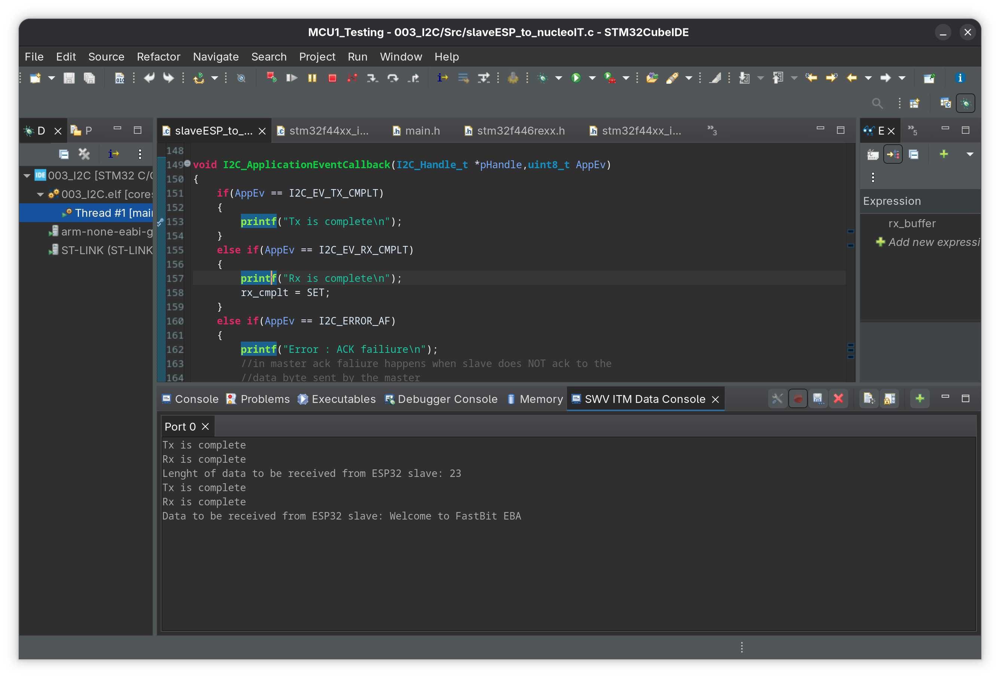
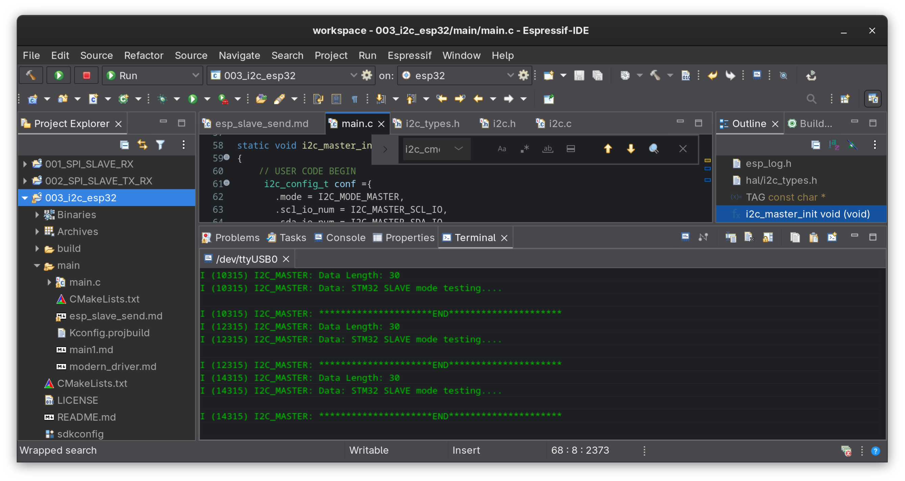
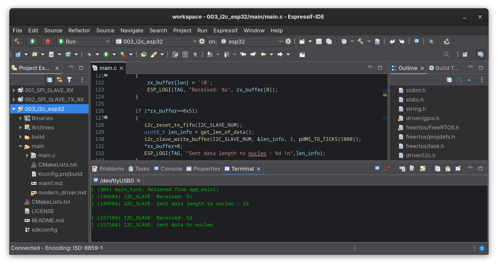
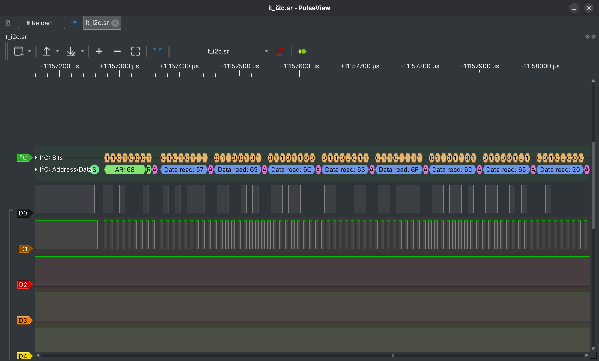

# I2C Cross-Platform Communication between STM32 Nucleo-F446RE ↔ ESP32

Bare-metal STM32 I2C driver talking to an ESP-IDF based ESP32, tested in both
directions (each board as master and as slave) with both polling and
interrupt-driven (IT) APIs.

## Hardware

- STM32 Nucleo-F446RE using custom bare-metal I2C1 driver
- ESP32 WROOM-32 (NodeMCU-32S devkit) using ESP-IDF
- Logic analyzer + PulseView for bus capture

| Signal | STM32 (Nucleo) | ESP32   |
|--------|----------------|---------|
| SDA    | PB7            | GPIO21  |
| SCL    | PB6            | GPIO22  |
| GND    | GND            | GND     |

Pull-ups: 4.7kΩ recommended on both lines (tested with STM32-side pull-ups;
only one device needs to supply them).

## Tools

- STM32CubeIDE (Nucleo-F446RE firmware)
- Espressif-IDE / ESP-IDF v5.5.3 (ESP32 firmware)
- PulseView (bus capture/analysis)

## What's implemented

| Exercise | ESP32 | Nucleo | API |
|----------|-------|--------|-----|
| Basic receiver | Slave | Master | Polling |
| Command/response (`0x51` / `0x52`) | Slave | Master | Polling → Interrupt-driven |
| Variable-length protocol (4-byte length + chunked reads) | Master | Slave | IT based |

## Screenshots

### STM32CubeIDE
- Interrupt based custom bare-metal APIs used to receive data from slave esp32

### Espressif-IDE
- Nucleo as slave sending data to esp32

- ESP32 as slave sending data to Nucleo

### PulseView captures
- Data being read by nucleo from esp32 slave ("Welcome to Fastbit EBA")

- Data being read by ESP32 from nucleo slave

## Known issues & how they were (or weren't) solved

### 1. ESP32 slave returning corrupted/stale data

**Symptom:** correct data on the first read, garbage on the next (e.g. a
length byte decoding as `0x57` or the ASCII `'W'` left over from the
previous response string).

**Cause:** the legacy ESP32 slave driver only moves bytes from hardware into
the software buffer on a FIFO-fill threshold or a bus-idle timeout. With the
master issuing the command and the follow-up read back-to-back, the ESP32's
FreeRTOS task hadn't loaded the real response yet so the master read stale
bytes from a previous transaction.

**Fix:** added a small delay on the master between sending the command and
requesting the response.

### 2. Repeated start (Sr) silently breaking the slave

**Symptom:** switching the STM32 master to IT calls with repeated start
(`I2C_ENABLE_SR`) made the ESP32 slave stop receiving anything at all —
no corruption, just nothing.

**Cause:** the idle-timeout that flushes a received byte to software never
fires if the bus never goes idle which is exactly what repeated start
guarantees (no STOP between transactions).

**Fix:** disabled Sr (real STOP + START) for this exchange, combined with
the delay above and IT-driven master calls.

### 3. Root cause: ESP32 cannot clock-stretch as an I2C slave

Per Espressif's own documentation, the original ESP32 does not support clock
stretching in slave mode so there's no hardware mechanism for the slave to
pause the master while firmware catches up. Espressif explicitly recommends
handling synchronization at the application layer (timing margin, a GPIO
handshake signal, or data verification + retry).
