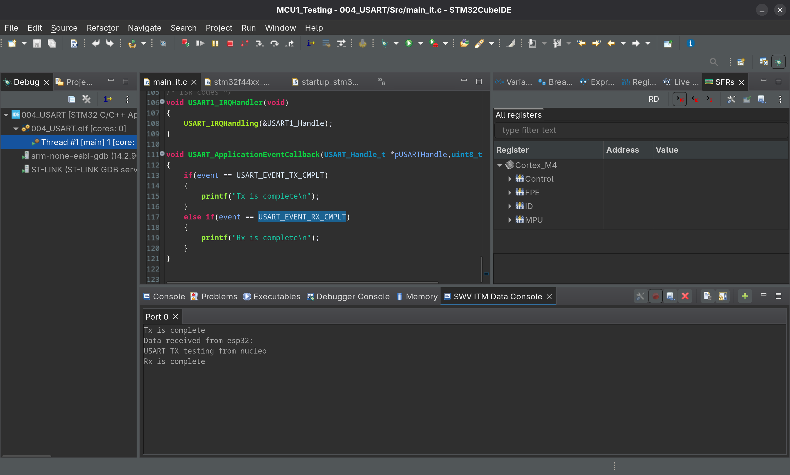
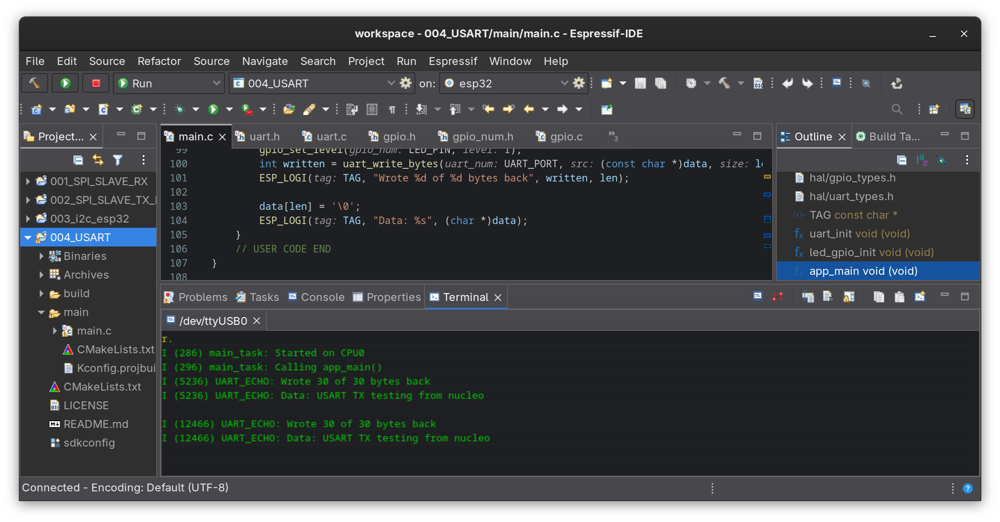
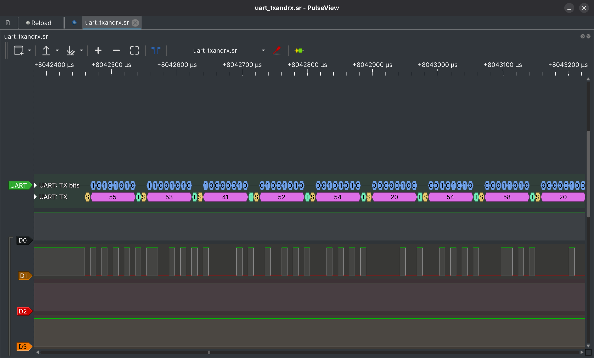
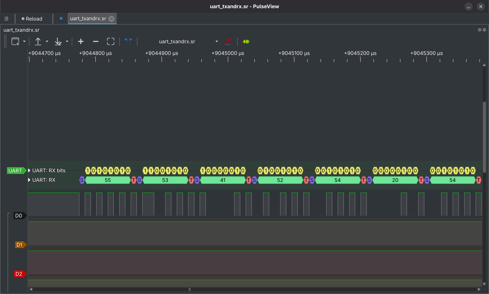

# UART/USART Cross-Platform Communication between STM32 Nucleo-F446RE ↔ ESP32

Simple byte-echo link between a bare-metal STM32 USART1 driver and an
ESP-IDF UART2 driver on the ESP32, tested with both polling and
interrupt-driven (IT) APIs on the STM32 side

## Hardware

| Signal | STM32 (Nucleo, USART1) | ESP32 (UART2) |
|--------|------------------------|---------------|
| TX     | PA9                    | GPIO17        |
| RX     | PA10                   | GPIO16        |
| GND    | GND                    | GND           |

Wiring is crossed, as always with UART: PA9 (Nucleo TX) → GPIO16 (ESP32
RX), GPIO17 (ESP32 TX) → PA10 (Nucleo RX). Baud rate: 115200, 8N1.

ESP32 side deliberately uses UART2, not UART0 because UART0 is wired
internally to the USB-serial chip and carries the `idf.py monitor` /
`ESP_LOGI` console; routing this exercise through it would have
collided with the console.

## Tools

- STM32CubeIDE (Nucleo-F446RE firmware)
- Espressif-IDE / ESP-IDF v5.5.3 (ESP32 firmware)
- PulseView (bus capture/analysis)

## What's implemented

| Exercise   | ESP32                          | Nucleo                                | API |
|------------|---------------------------------|----------------------------------------|-----|
| UART echo  | Echo responder (`driver/uart.h`, UART2) | Sends message, reads echo back | Polling (`USART_SendData` / `USART_ReceiveData`) |
| UART echo  | Echo responder (`driver/uart.h`, UART2) | Sends message, reads echo back | Interrupt-driven (`USART_SendDataIT` / `USART_ReceiveDataIT`) |

## Screenshots

### STM32CubeIDE
- Interrupt based custom bare-metal APIs used to send and receive data from esp32


### Espressif-IDE
- Data being received and echoed back to nucleo by esp32


### PulseView captures
> Nucleo sending data to esp32 


> Esp32 sending same data back to nucleo


## Known issues & lessons learned

### 1. `uart_driver_install()` failing silently on a too-small RX buffer

**Symptom:** every `uart_read_bytes()` / `uart_write_bytes()` call on the
ESP32 errored, with garbled garbage logged as "received data."

**Cause:** the RX ring buffer size passed to `uart_driver_install()` was
set to exactly 128, the same size as the UART's hardware FIFO. ESP-IDF
requires it to be strictly *larger* than that, so installation failed.
Because the return value was never checked, the failure was invisible thus
every later call into a never-created driver instance just errored.

**Fix:** raised the buffer to 256, and wrapped the init calls in
`ESP_ERROR_CHECK()` so a failure like this surfaces immediately instead
of producing confusing downstream symptoms.

### 2. `pin_bit_mask` set to a pin number instead of a bitmask

**Symptom:** the console connection physically dropped the moment GPIO
init ran; log output cut off mid-character.

**Cause:** `gpio_config_t.pin_bit_mask` expects a bitmask, not a raw pin
number. Passing the LED's GPIO number directly configured the *wrong*
pin (off-by-one in bit position) as a digital output thus landing on
GPIO1, which is wired internally to the USB-serial chip and carries the
console itself.

**Fix:** `.pin_bit_mask = (1ULL << LED_PIN)`.

### 3. Missing semicolon turned an `if`/`else` block into part of a wait loop

**Symptom:** the custom `USART_ReceiveData()` appeared to hang forever;
single-stepping showed the if/else branches executing repeatedly before
`RXNE` ever went true, which looked inexplicable at the time.

**Cause:**
```c
while (!USART_GetFlagStatus(...))   // <- no semicolon, no braces

if (...) { ... }
```
With no semicolon or braces, C treats the very next statement as the
loop's body. The byte-read-and-increment logic was unintentionally
*inside* the wait loop, running every spin instead of once per real
byte, corrupting the destination buffer continuously while waiting,
and never terminating if no byte ever arrived.

**Fix:** added the semicolon to close the empty wait loop. Adopted
explicit empty braces (`while (...) { }`) on future polling loops to
make this class of mistake visually obvious.

### 4. `USART_GetFlagStatus()` called with the bit-position macro instead of the shifted flag mask

**Symptom:** even after fixing the dangling-statement bug above, the
wait loop still never proceeded but `RXNE` was confirmed set in the
debugger's peripheral register view, but the polling loop never
detected it and stayed stuck.

**Cause:** the flag-check call was passing the raw bit-position macro
(e.g. `USART_SR_RXNE` defined as just the bit number) instead of the
actual flag mask (`1 << USART_SR_RXNE`). Comparing the status register
against an unshifted bit-position value tests the wrong bit(s)
entirely, so the function could never correctly report that RXNE had
gone high, regardless of the real hardware state.

**Fix:** passed the properly left-shifted flag mask into
`USART_GetFlagStatus()` instead of the bare bit-position macro.

### 5. Single-byte destination for a multi-byte receive

**Symptom:** undefined/crashing behavior once issue #5 was fixed.

**Cause:** `uint8_t rcv_buf;` (a single byte) was passed to
`USART_ReceiveData()` expecting `len` (~30) bytes which was writing well past
the variable into adjacent stack memory.

**Fix:** sized `rcv_buf` as a real array (`uint8_t rcv_buf[1024]`) and
null-terminated it at the actual received length before printing.
